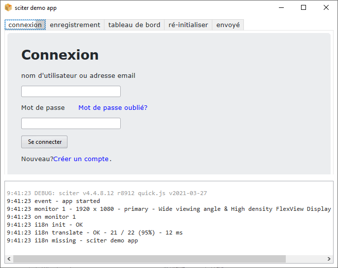

# sciter demo application

This is a [sciter.js](https://sciter.com/) demo standalone application (executable).
It can be used as the starting point to build your own app.

## features

- logger
- dialogs
- translation engine
- theme
- pagecontrol
- in-app analytics (work in progress)

## executable demos

[Windows x64](https://github.com/8ctopus/sciter-demo-app/releases/download/1.0.8/demo-winx64.exe)
[Windows x32](https://github.com/8ctopus/sciter-demo-app/releases/download/1.0.8/demo-winx32.exe)
[Linux](https://github.com/8ctopus/sciter-demo-app/releases/download/1.0.8/demo-linux)
[Mac](https://github.com/8ctopus/sciter-demo-app/releases/download/1.0.8/demo-macosx)

check the `Releases` for sha256

## demo

- git clone the repository
- install packages `npm install`
- install latest sciter sdk `npm run install-sdk`
- start the demo `npm run scapp`

## demo requirements

- A recent version of Node.js `node` (tested with 16 LTS) and its package manager `npm`.
    - On Windows [download](https://nodejs.dev/download/) and run the installer
    - On Linux check the [installation guide](https://www.digitalocean.com/community/tutorials/how-to-install-node-js-on-ubuntu-20-04#option-2-%E2%80%94-installing-node-js-with-apt-using-a-nodesource-ppa)

## build executable

To build the app binary, run script `build.bat` (Win) or `./build.sh` (Linux/Mac).

## requirements

- [Sciter package manager](https://github.com/8ctopus/sciter-package-manager) to install dependencies
- Sciter package manager itself requires php >= 7.3
- [ImageMagick](https://imagemagick.org/) to create the exe icon (Windows only)
