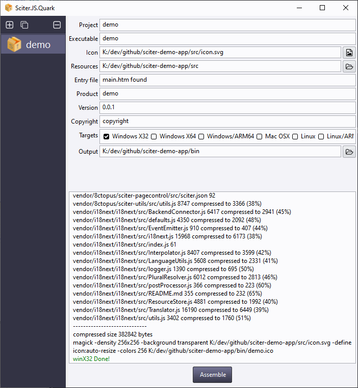

# sciter demo application

This is a [sciter.js](https://sciter.com/) demo standalone application.
It can be used as the starting point to build your app.


## features

- logger
- dialogs
- translation engine
- theme
- pagecontrol
- in-app analytics

## demo

Check the Windows pre-built executable in releases [demo.exe](https://github.com/8ctopus/sciter-demo-app/releases/download/1.0.0/demo.exe)

## requirements

- [Sciter package manager](https://github.com/8ctopus/sciter-package-manager) requires php
- [ImageMagick](https://imagemagick.org/) is required to build the executable

## install

- git clone the repository
- run `install.bat` to download the latest sciter binaries and the sciter package manager
- install packages

```sh
cd src
php ../bin/spm.phar install
```

- run script `scapp.bat`
- to refresh the app after changes to the html/css click `F5`

## build executable

To build the app executable, run script `quark.bat`, complete the form as on the screenshot and finally click `Assemble`.


